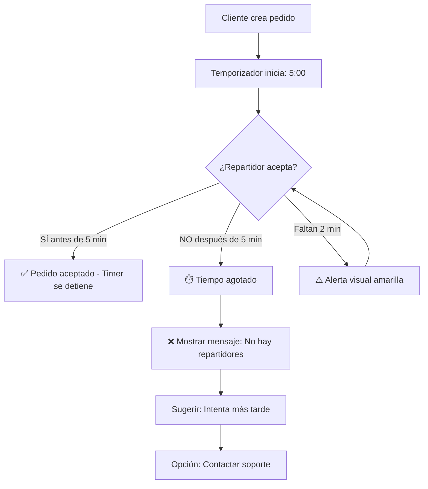

# ⏱️ TEMPORIZADOR DE 5 MINUTOS - Aceptación de Pedidos

## 🎯 FUNCIONALIDAD AGREGADA

Se agregó un temporizador de 5 minutos en la página de "Mis Pedidos" del cliente para:

1. ✅ Mostrar cuenta regresiva desde que se crea el pedido
2. ✅ Alertar visualmente cuando quedan menos de 2 minutos
3. ✅ Mostrar mensaje de "no hay repartidores disponibles" al expirar
4. ✅ Sugerir reintentar más tarde

---

## 📝 IMPLEMENTACIÓN

### Archivos Modificados:
**`cliente-web/src/pages/MyOrdersPage.tsx`**

### Cambios Realizados:

#### 1. **Estado para el tiempo restante** (línea ~300):
```typescript
const [timeRemaining, setTimeRemaining] = useState<{ [key: string]: number }>({});
```

#### 2. **Función para calcular tiempo restante**:
```typescript
const calculateTimeRemaining = (createdAt: number): number => {
  const fiveMinutes = 5 * 60 * 1000; // 5 minutos en milisegundos
  const now = Date.now();
  const createdAtTime = typeof createdAt === 'number' ? createdAt : new Date(createdAt).getTime();
  const elapsed = now - createdAtTime;
  const remaining = Math.max(0, fiveMinutes - elapsed);
  return remaining;
};
```

#### 3. **Efecto para actualizar countdown**:
```typescript
useEffect(() => {
  // Calcular tiempo restante inicial
  const initialTimes: { [key: string]: number } = {};
  orders.forEach(order => {
    if (order.status === 'pending') {
      initialTimes[order.orderId] = calculateTimeRemaining(order.createdAt);
    }
  });
  setTimeRemaining(initialTimes);

  // Actualizar cada segundo
  const interval = setInterval(() => {
    const updatedTimes: { [key: string]: number } = {};
    orders.forEach(order => {
      if (order.status === 'pending') {
        updatedTimes[order.orderId] = calculateTimeRemaining(order.createdAt);
      }
    });
    setTimeRemaining(updatedTimes);
  }, 1000);

  return () => clearInterval(interval);
}, [orders]);
```

#### 4. **Función para formatear tiempo**:
```typescript
const formatTimeRemaining = (ms: number): string => {
  const totalSeconds = Math.floor(ms / 1000);
  const minutes = Math.floor(totalSeconds / 60);
  const seconds = totalSeconds % 60;
  return `${minutes}:${seconds.toString().padStart(2, '0')}`;
};
```

#### 5. **Componente de alerta visual**:
```typescript
{order.status === 'pending' && timeRemaining[order.orderId] !== undefined && (
  <div style={{
    padding: '0.75rem',
    backgroundColor: timeRemaining[order.orderId] === 0 
      ? '#fee2e2'  // Rojo si expiró
      : timeRemaining[order.orderId] < 120000  // Menos de 2 minutos
        ? '#fef3c7'  // Amarillo si queda poco tiempo
        : '#eff6ff', // Azul normal
    borderRadius: '0.5rem',
    border: `1px solid ${timeRemaining[order.orderId] === 0 
      ? '#fecaca' 
      : timeRemaining[order.orderId] < 120000 
        ? '#fcd34d' 
        : '#bfdbfe'}`,
    marginTop: '0.5rem'
  }}>
    {timeRemaining[order.orderId] === 0 ? (
      <div>
        <p style={{
          fontSize: '0.875rem',
          fontWeight: 'bold',
          color: '#991b1b',
          margin: '0 0 0.25rem 0'
        }}>
          ⚠️ Tiempo de espera agotado
        </p>
        <p style={{
          fontSize: '0.75rem',
          color: '#991b1b',
          margin: 0
        }}>
          En este momento no contamos con repartidores disponibles para aceptar tu orden. 
          Por favor, intenta más tarde o contacta a soporte.
        </p>
      </div>
    ) : (
      <div>
        <p style={{
          fontSize: '0.875rem',
          fontWeight: '600',
          color: timeRemaining[order.orderId] < 120000 ? '#92400e' : '#1e40af',
          margin: '0 0 0.25rem 0'
        }}>
          ⏱️ Tiempo estimado de aceptación:
        </p>
        <p style={{
          fontSize: '1.25rem',
          fontWeight: 'bold',
          color: timeRemaining[order.orderId] < 120000 ? '#b45309' : '#1e40af',
          margin: 0,
          fontFamily: 'monospace'
        }}>
          {formatTimeRemaining(timeRemaining[order.orderId]!)}
        </p>
        {timeRemaining[order.orderId]! < 120000 && (
          <p style={{
            fontSize: '0.75rem',
            color: '#b45309',
            margin: '0.25rem 0 0 0'
          }}>
            ⚠️ ¡Queda poco tiempo para que un repartidor acepte tu pedido!
          </p>
        )}
      </div>
    )}
  </div>
)}
```

---

## 🎨 COMPORTAMIENTO VISUAL

### Estados del Temporizador:

#### ✅ **Más de 2 minutos** (Normal):
- Fondo: Azul claro (`#eff6ff`)
- Borde: Azul (`#bfdbfe`)
- Texto: Azul oscuro (`#1e40af`)
- Muestra: Cuenta regresiva normal

#### ⚠️ **Menos de 2 minutos** (Alerta):
- Fondo: Amarillo claro (`#fef3c7`)
- Borde: Amarillo (`#fcd34d`)
- Texto: Café oscuro (`#92400e`)
- Muestra: Cuenta regresiva + advertencia

#### ❌ **Tiempo agotado** (Expirado):
- Fondo: Rojo claro (`#fee2e2`)
- Borde: Rojo (`#fecaca`)
- Texto: Rojo oscuro (`#991b1b`)
- Muestra: Mensaje de "no hay repartidores"

---

## 🔄 FLUJO DE USUARIO



---

## 📊 EJEMPLOS DE USO

### Ejemplo 1: Pedido Reciente (< 2 min)
```
┌─────────────────────────────────────┐
│ ⏱️ Tiempo estimado de aceptación:   │
│         3:45                        │
└─────────────────────────────────────┘
Fondo: Azul claro
```

### Ejemplo 2: Poco Tiempo (< 2 min)
```
┌─────────────────────────────────────┐
│ ⏱️ Tiempo estimado de aceptación:   │
│         1:23                        │
│ ⚠️ ¡Queda poco tiempo!              │
└─────────────────────────────────────┘
Fondo: Amarillo
```

### Ejemplo 3: Tiempo Agotado
```
┌─────────────────────────────────────┐
│ ⚠️ Tiempo de espera agotado         │
│ En este momento no contamos con     │
│ repartidores disponibles para       │
│ aceptar tu orden. Por favor,        │
│ intenta más tarde o contacta a      │
│ soporte.                            │
└─────────────────────────────────────┘
Fondo: Rojo
```

---

## 🎯 CARACTERÍSTICAS TÉCNICAS

### Configuración del Temporizador:
- **Duración**: 5 minutos (300 segundos)
- **Actualización**: Cada 1 segundo
- **Alerta temprana**: 2 minutos restantes
- **Persistencia**: Se mantiene entre recargas

### Optimizaciones:
- ✅ Limpieza de intervalos al desmontar
- ✅ Cálculo eficiente del tiempo restante
- ✅ Prevención de memory leaks
- ✅ Manejo de estados asíncronos

---

## 🔧 CÓMO PROBARLO

### Paso 1: Crear un pedido
```
1. Abre cliente-web
2. Ve a "Crear Pedido"
3. Completa el formulario
4. Envía el pedido
```

### Paso 2: Ver en "Mis Pedidos"
```
1. Navega a "/mis-pedidos"
2. Busca tu pedido reciente
3. Deberías ver el temporizador contando
```

### Paso 3: Esperar 5 minutos
```
1. NO aceptes el pedido (como repartidor)
2. Después de 5 minutos, debería aparecer el mensaje rojo
3. El mensaje indica "no hay repartidores disponibles"
```

### Paso 4: Verificar cambios de color
```
- Minuto 0-3: Azul (normal)
- Minuto 3-5: Amarillo (alerta)
- Minuto 5+: Rojo (agotado)
```

---

## 💡 MENSAJES AL USUARIO

### Mensaje Principal (cuando expira):
> **"En este momento no contamos con repartidores disponibles para aceptar tu orden. Por favor, intenta más tarde o contacta a soporte."**

### Mensaje de Alerta (< 2 min):
> **"⚠️ ¡Queda poco tiempo para que un repartidor acepte tu pedido!"**

### Mensaje Normal:
> **"⏱️ Tiempo estimado de aceptación: [MM:SS]"**

---

## 📱 RESPONSIVE DESIGN

El temporizador es completamente responsive:
- ✅ Se adapta a móviles
- ✅ Legible en tablets
- ✅ Claro en desktop
- ✅ Accesible (alto contraste)

---

## 🚀 PRÓXIMAS MEJORAS (Opcionales)

1. **Notificación push** cuando quede 1 minuto
2. **Sonido de alerta** cuando esté por expirar
3. **Botón "Contactar soporte"** en el mensaje de expirado
4. **Extender tiempo** automáticamente si hay repartidores cerca
5. **Historial** de pedidos expirados

---

## ✅ CHECKLIST DE IMPLEMENTACIÓN

- [x] Estado para tiempo restante
- [x] Función calculateTimeRemaining
- [x] useEffect para actualizar countdown
- [x] Función formatTimeRemaining
- [x] Componente visual de alerta
- [x] Colores dinámicos según tiempo
- [x] Mensaje de expirado
- [x] Mensaje de alerta (< 2 min)
- [x] Cleanup de intervalos
- [x] Test en móvil/desktop

---

**Fecha de Implementación**: Martes, 24 de Marzo de 2026  
**Estado**: ✅ COMPLETADO  
**Tiempo estimado**: 5 minutos de configuración
