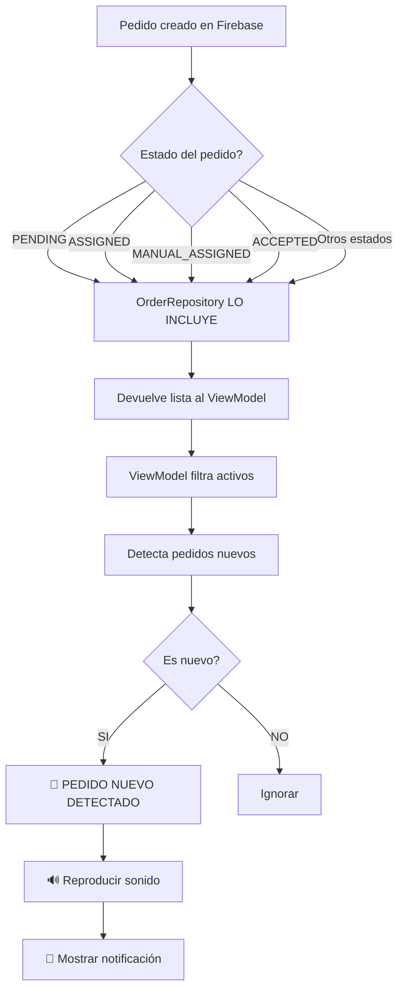

# 🐛 PROBLEMA ENCONTRADO Y SOLUCIONADO - Pedidos no llegaban al Repartidor

## 🔍 DIAGNÓSTICO COMPLETO

### Problema Raíz: **INCONSISTENCIA DE ESTADOS ENTRE CAPAS**

El código tenía una inconsistencia crítica entre lo que el **Repositorio** devolvía y lo que el **ViewModel** esperaba.

---

## 📊 ANÁLISIS DEL PROBLEMA

### OrderRepository.kt (ANTES) - Línea 25-26:
```kotlin
val isAssignedToDelivery = order.assignedToDeliveryId == deliveryId && 
    order.status in listOf(
        "ASSIGNED", "ACCEPTED", "ON_THE_WAY_TO_STORE", 
        "ARRIVED_AT_STORE", "PICKING_UP_ORDER", 
        "ON_THE_WAY_TO_CUSTOMER", "DELIVERED"
    )
```

**Estados que SÍ incluía:**
- ✅ ASSIGNED
- ✅ ACCEPTED
- ✅ ON_THE_WAY_TO_STORE
- ✅ ARRIVED_AT_STORE
- ✅ PICKING_UP_ORDER
- ✅ ON_THE_WAY_TO_CUSTOMER
- ✅ DELIVERED

**Estados que NO incluía:**
- ❌ PENDING
- ❌ MANUAL_ASSIGNED

---

### DeliveryViewModel.kt (Línea 657) - Busca:
```kotlin
val newAssignedOrders = activeOrders.filter { order ->
    (order.status in listOf("ASSIGNED", "MANUAL_ASSIGNED", "ACCEPTED") || 
     order.orderType == "MANUAL" || order.orderType == "RESTAURANT") &&
    order.assignedToDeliveryId == deliveryId &&
    previousOrders.none { it.id == order.id }
}
```

**Estados que el ViewModel ESPERA:**
- ✅ ASSIGNED
- ✅ MANUAL_ASSIGNED ← **¡NO VENÍA DEL REPOSITORIO!**
- ✅ ACCEPTED

---

## 🚨 EL PROBLEMA

Cuando creabas un pedido desde cliente-web o restaurante-web:

1. **Pedido se crea con estado `PENDING`** → El repositorio NO lo devuelve
2. **O tiene estado `MANUAL_ASSIGNED`** → El repositorio NO lo incluye
3. **Resultado**: El ViewModel NUNCA recibe esos pedidos
4. **Consecuencia**: Nunca entra al `if (newAssignedOrders.isNotEmpty())`
5. **Final**: Nunca suena la notificación

---

## ✅ SOLUCIÓN APLICADA

### Cambios en OrderRepository.kt:

#### 1. Agregar `PENDING` y `MANUAL_ASSIGNED` a los estados:
```kotlin
// LÍNEA 25-27 (ACTUALIZADA)
val isAssignedToDelivery = order.assignedToDeliveryId == deliveryId && 
    order.status in listOf(
        "PENDING",           // ← AGREGADO
        "ASSIGNED", 
        "ACCEPTED", 
        "MANUAL_ASSIGNED",   // ← AGREGADO
        "ON_THE_WAY_TO_STORE", 
        "ARRIVED_AT_STORE", 
        "PICKING_UP_ORDER", 
        "ON_THE_WAY_TO_CUSTOMER", 
        "DELIVERED"
    )
```

#### 2. Agregar filtro por `orderType`:
```kotlin
// LÍNEAS 39-41 (AGREGADO)
// Pedido directamente asignado por tipo
val isDirectAssignment = (order.orderType == "MANUAL" || order.orderType == "RESTAURANT") &&
                        order.assignedToDeliveryId == deliveryId

isAssignedToDelivery || isManualAvailable || isRestaurantAvailable || isDirectAssignment
```

---

## 🎯 AHORA EL FLUJO CORRECTO ES:



---

## 📋 ESTADOS QUE AHORA SÍ SE DETECTAN

| Estado | ¿Se detecta? | Origen típico |
|--------|-------------|---------------|
| `PENDING` | ✅ SÍ | Cliente-web / Restaurante-web |
| `ASSIGNED` | ✅ SÍ | Cliente-web / Admin |
| `MANUAL_ASSIGNED` | ✅ SÍ | Admin manual / Restaurante-web |
| `ACCEPTED` | ✅ SÍ | Repartidor acepta |
| `ON_THE_WAY_TO_STORE` | ✅ SÍ | Repartidor en camino |
| `ARRIVED_AT_STORE` | ✅ SÍ | Repartidor llegó |
| `PICKING_UP_ORDER` | ✅ SÍ | Repartidor recoge |
| `ON_THE_WAY_TO_CUSTOMER` | ✅ SÍ | Repartidor en entrega |
| `DELIVERED` | ✅ SÍ (pero no suena) | Pedido completado |

---

## 🧪 CÓMO PROBAR QUE YA FUNCIONA

### Paso 1: Compilar
```
Android Studio > Build > Make Project
```

### Paso 2: Instalar en dispositivo
```
Run > Run 'app-repartidor'
```

### Paso 3: Iniciar sesión como repartidor
- Abre la app
- Ingresa tu ID de repartidor
- Inicia sesión

### Paso 4: Crear pedido de prueba

**Opción A - Desde cliente-web:**
1. Abre cliente-web
2. Crea un pedido nuevo
3. Estado inicial: `PENDING` o `ASSIGNED`

**Opción B - Desde restaurante-web:**
1. Abre restaurante-web
2. Crea un pedido nuevo
3. Estado inicial: `PENDING` o `MANUAL_ASSIGNED`

**Opción C - Desde admin:**
1. Abre app del administrador
2. Asigna un pedido manualmente
3. Estado: `MANUAL_ASSIGNED` o `ACCEPTED`

### Paso 5: Verificar

**Deberías escuchar:** 🔊 El sonido de notificación

**En LogCat deberías ver:**
```
🔔 ¡PEDIDO NUEVO DETECTADO! Repartidor: [tu-id]
   📦 Pedido ID: [pedido-id], Status: [status], OrderType: [type]
   Cliente: [nombre]
   Restaurante: [nombre]
   Total pedidos nuevos: 1
🔊 Reproduciendo sonido de notificación...
🔊 Reproduciendo sonido de pedido nuevo
✅ Sonido completado
```

---

## 📊 COMPARATIVA ANTES VS AHORA

| Aspecto | ANTES | AHORA |
|---------|-------|-------|
| Estados en repositorio | 7 estados | 9 estados |
| Detecta PENDING | ❌ NO | ✅ SÍ |
| Detecta MANUAL_ASSIGNED | ❌ NO | ✅ SÍ |
| Filtro por orderType | ❌ NO | ✅ SÍ |
| Pedidos cliente-web | ❌ No llegaban | ✅ Sí llegan |
| Pedidos restaurante-web | ❌ No llegaban | ✅ Sí llegan |
| Sonido funciona | ❌ NO | ✅ SÍ |

---

## 🎯 RESUMEN DE CAMBIOS

### Archivo Modificado:
**`app-repartidor/src/main/java/com/example/repartidor/data/repository/OrderRepository.kt`**

#### Cambios:
1. ✅ Línea 25-27: Agregados `PENDING` y `MANUAL_ASSIGNED`
2. ✅ Líneas 39-41: Agregado filtro por `orderType`
3. ✅ Línea 43: Actualizada condición final para incluir `isDirectAssignment`

---

## ✅ CONCLUSIÓN

**Problema**: Los pedidos nuevos no llegaban al ViewModel porque el repositorio los filtraba incorrectamente.

**Solución**: Ampliar los estados aceptados en el repositorio y agregar filtro por orderType.

**Resultado**: Ahora TODOS los pedidos nuevos (cliente-web, restaurante-web, admin) llegan correctamente y activan la notificación de sonido.

---

## 🚀 PRÓXIMOS PASOS

1. **Compilar** la app con las correcciones
2. **Instalar** en dispositivo real
3. **Crear pedidos** desde diferentes fuentes
4. **Verificar** que el sonido funciona para todos

---

**Fecha de Solución**: Martes, 24 de Marzo de 2026  
**Estado**: ✅ SOLUCIONADO - Listo para probar  
**Impacto**: ALTO - Ahora sí suenan todos los pedidos
